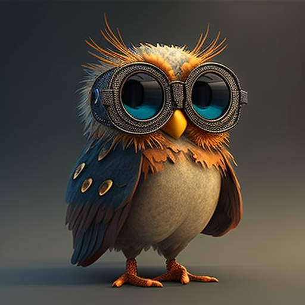
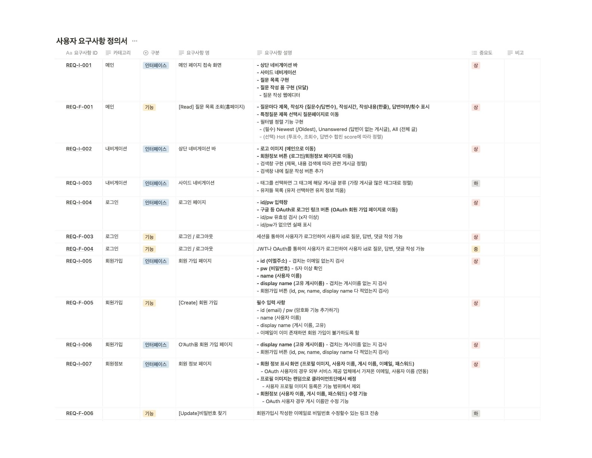
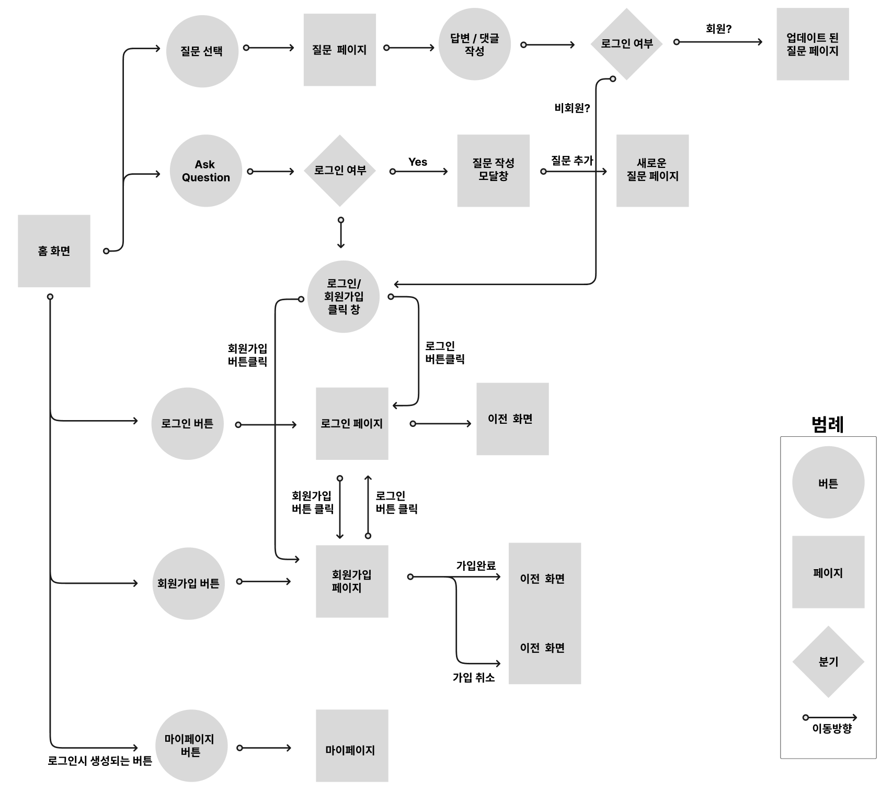
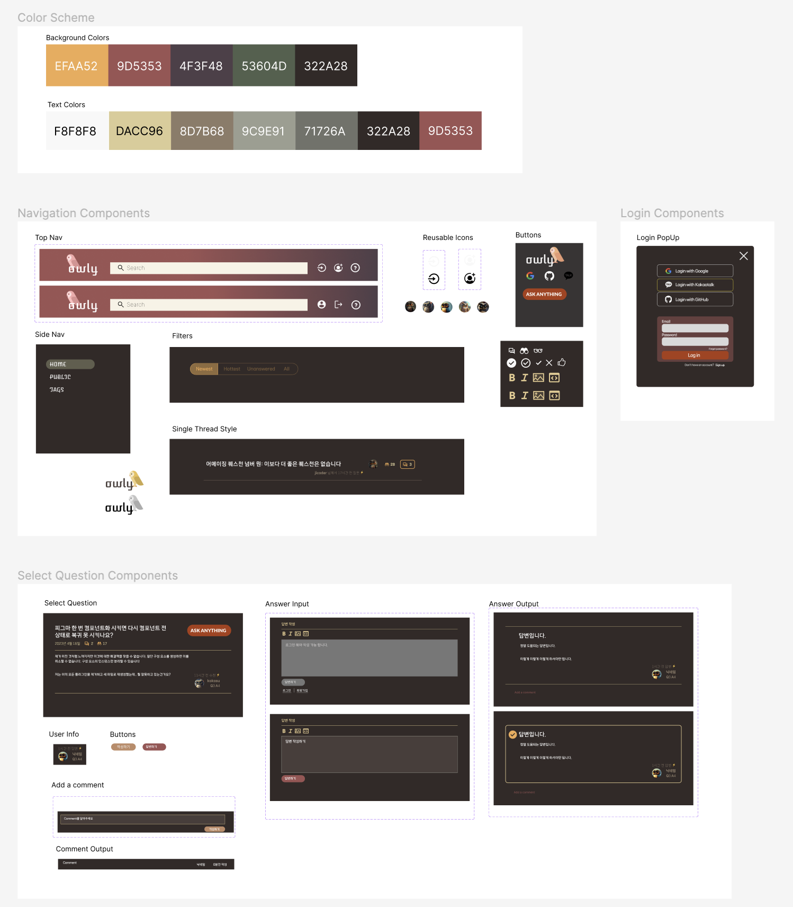
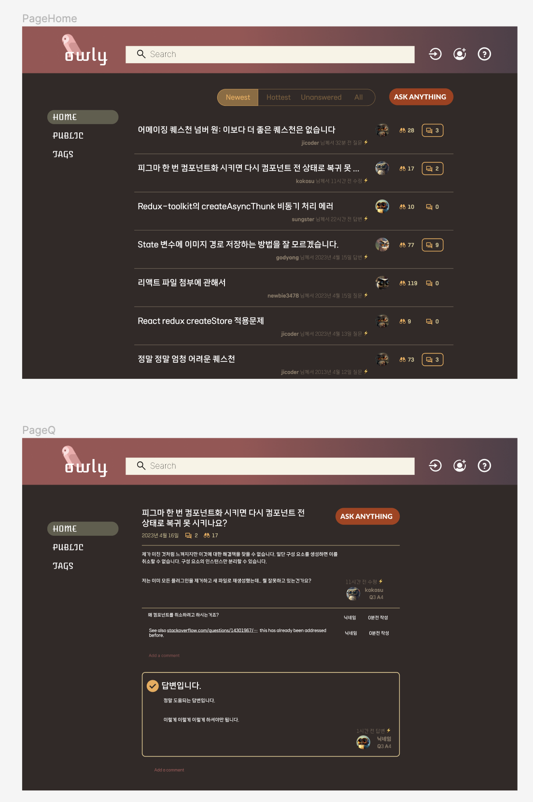
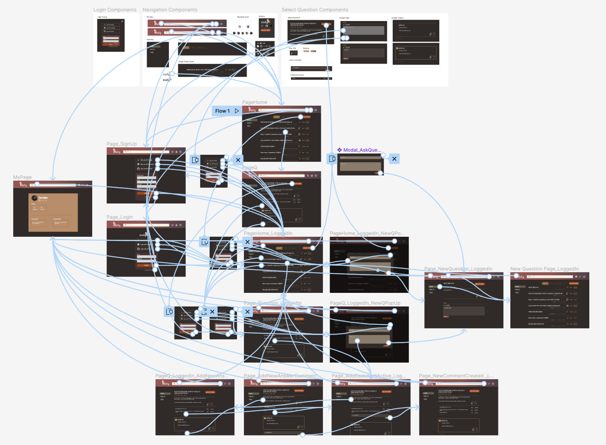

## 🦉 Owly

   
  
   

* Team Name : Hoot
* Project Name : Owly
    * A Website For Programmers To Ask And Answer Questions
    * Stack Overflow Clone Coding
* Duration : 2023.04.14 - 2023.04.27
* Link : Click <a href="http://pre-project-43-035.s3-website.ap-northeast-2.amazonaws.com/">HERE</a> to experience Owly!

 

## 🧑‍🤝‍🧑 Team members
| 이연수 (BE Leader) | 전지영 (BE) | 고유강 (BE) |
|:--------:| :--------: | :--------: |
| |  |  | 
|[@yeonssu](https://github.com/yeonssu) | [@jyoungGrace](https://github.com/jyoungGrace) | [@KYOOKANG](https://github.com/KYOOKANG) | 
| 
 - Signup  - Automated welcome email - Spring Security (Authentication, Authorization,  JWT, OAuth) - Member CRUD - AWS deployment | 
- Question CRUD - Answer CUD - Search by title, content - viewCount increase function  - Adopt answers | 
- Question Reply CUD - Answer Reply CUD  - Exception Code | 

| 장성아 (FE Leader) | 지우석 (FE) | 고상민 (FE) |
| :--------: | :--------: | :--------: |
|  |  |  |
| [@splazt](https://github.com/splazt) | [@Zeereoreo](https://github.com/Zeereoreo) | [@Gorden-Dosi](https://github.com/Gorden-Dosi) |
| 
- Main Page (Inf. Scroll) - UI Design & User Flow Head - Token Authentication - Login Status & Member  &nbsp; &nbsp; Access Control - Ask Page (C) - Q&A & QA-Replies CRUD - Header / Sidebar  - Responsive Design |
- Question Page - Question UD - Answer CRUD - QA-Replies CRUD - Members-Only Features - Header - AWS Deployment / Release  |
- Member Info Page (RUD) - Login (R), Signup (C) Page - ID/PW Validation  - Logo Design ||||

 

## 📌 Introduction to Project Features

### 회원 기능
- 회원가입
- 로그인 / 로그아웃
- 회원 정보 조회 (마이페이지)
- 회원 정보 수정 (자신의 정보만 수정 가능)
- 회원 정보 삭제 (자신의 정보만 삭제 가능)

### 질문(게시글) 기능
- 질문 조회 (회원이 아닌 사람도 조회 가능)
    - 관련 답변, 댓글 모두 조회 가능
- 질문 작성 (회원만 가능)
- 질문 수정 (질문 작성자만 가능)
- 질문 삭제 (질문 작성자만 가능)
    - 질문 삭제 시, 질문 조회 불가능
    - 질문 삭제 시, 관련 답변 모두 조회 불가능
    - 질문 삭제 시, 관련 댓글 모두 조회 불가능

### 답변 기능
- 답변 작성 (답변 작성자만 가능)
- 답변 수정 (답변 작성자만 가능)
- 답변 삭제 (답변 작성자만 가능)
- 답변 채택 기능 (질문 작성자만 가능)

### 댓글 기능
- 질문에 댓글 작성 (댓글 작성자만 가능)
- 질문에 달린 댓글 수정 (댓글 작성자만 가능)
- 질문에 달린 댓글 삭제 (댓글 작성자만 가능)
- 답변에 댓글 작성 (댓글 작성자만 가능)
- 답변에 달린 댓글 수정 (댓글 작성자만 가능)
- 답변에 달린 댓글 삭제 (댓글 작성자만 가능)

 

## 💻 Stacks Used
### Back-end
|   Java   |   Spring   |   Spring Boot   |   Spring Security   |   MySQL   |   AWS   |
| :----------------------------------------------------------: | :----------------------------------------------------------: | :----------------------------------------------------------: | :----------------------------------------------------------: | :----------------------------------------------------------: | :----------------------------------------------------------: |
| 

 |  |  |  | 

 | 

 |

 

### Front-end
|     Html     |     CSS     |     JavaScript     |     React     |     Styled Components     |     axios     |      esLint     |     Figma     |     React Router     |
| :----------------------------------------------------------: | :----------------------------------------------------------: | :----------------------------------------------------------: | :----------------------------------------------------------: | :----------------------------------------------------------: | :----------------------------------------------------------: | :----------------------------------------------------------: | :----------------------------------------------------------: | :----------------------------------------------------------: |
|  | 

 | 

 | 

 | 

 | 

 | 

 | 

 | 

 |

 

### Tools
| Github | Discord | Notion | 
| :--------: | :--------: | :------: |
|  |  |  |

 

## 🔖 Project Docs

### 사용자 요구사항 정의서

### DB Diagram

### Prototyping
[Wireframe Link (Figma)](https://www.figma.com/file/MaOjCuQ53oy3nMzOpHCvfi/화면-정의서?node-id=38%3A176&t=hsQJoweA07WvGrFY-1)

#### User Flow

#### UI Style (Figma)

#### Prototype (Figma)

 

## 🔗 Github Rule

### Commit Convention

|  Message   | 설명                                                  |
| :--------: | :---------------------------------------------------- |
| `add` | 새로운 프로젝트, 파일 등 추가 |
| `feat` | 새로운 기능 추가 |
| `fix` | 버그 수정 |
| `refactor` | 코드 리팩토링 |
| `style` | 코드 포맷팅, 세미콜론 누락, 코드 스타일 변경 등 |
| `remove` | 사용하지 않는 파일 또는 폴더 삭제 |
| `rename` | 파일 또는 폴더명 수정 |
| `chore` | 빌드 업무 수정, 패키지 매니저 수정 |

### Branch

- `main` : 서비스 운영 브랜치 
- `dev` : 메인 브랜치 배포전 릴리즈 브랜치  
- `be-dev` : BE 개발 환경 브랜치 
- `fe-dev` : FE 개발 환경 브랜치
- `be-feat/[feature name]` : BE 기능 개발 브랜치
- `fe-feat/[feature name]` : FE 기능 개발 브랜치

 

## Upcoming Features 

- 질문 목록 필터링 및 검색 기능 
- 답변 채택 기능
- 웹에디터
- Google OAuth 
- 모바일 반응형 디자인 (내비게이션, 사이드바)
